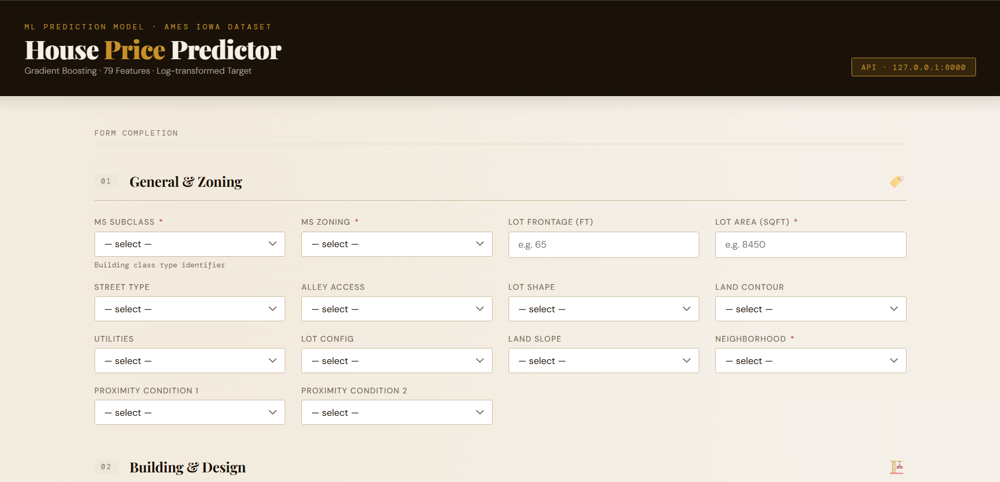
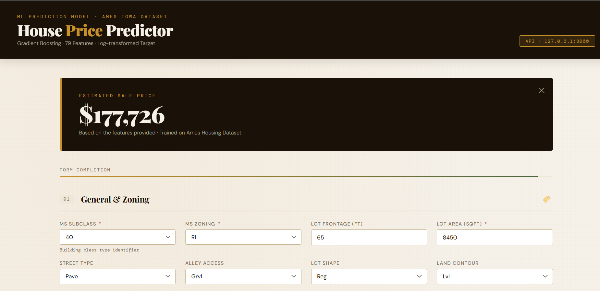

# 🏠 House Price Predictor


🌐 **Live Demo:** [http://3.144.98.225:8000/prediction_form](http://3.144.98.225:8000/prediction_form)

---

## 🚀 Overview

**House Price Predictor** is an end-to-end machine learning application that predicts residential property sale prices based on 79+ features of a house — from neighborhood and lot configuration to basement quality and garage finish.

The project solves a classic real estate problem: **given the physical and contextual attributes of a home, what is its likely market value?** It covers the full ML lifecycle — data ingestion, validation, feature engineering, model training, and serving predictions through a REST API with a user-friendly frontend.

This project is built on the **Ames Housing Dataset**, a well-known benchmark dataset for regression problems, and is structured following **production-grade software engineering practices** with modular pipelines, custom transformers, hyperparameter-tuned XGBoost, and a fully automated CI/CD pipeline that builds a Docker image and deploys to **AWS EC2** on every push.
Data link: https://www.kaggle.com/competitions/house-prices-advanced-regression-techniques/data 
---

## 🛠️ Tech Stack

| Category | Technology |
|---|---|
| **Language** | Python 3.14 |
| **Web Framework** | FastAPI 0.135 |
| **ASGI Server** | Uvicorn 0.42 |
| **ML Framework** | scikit-learn 1.8 |
| **Boosting Model** | XGBoost 3.2 |
| **Data Manipulation** | Pandas 3.0, NumPy 2.4 |
| **Statistical Analysis** | SciPy 1.17, Statsmodels 0.14 |
| **Visualization** | Matplotlib, Seaborn |
| **Serialization** | Dill 0.4 |
| **Containerization** | Docker |
| **CI/CD** | GitHub Actions |
| **Cloud Deployment** | AWS EC2 |
| **Hyperparameter Tuning** | GridSearchCV / RandomizedSearchCV |
| **Notebook Environment** | Jupyter Notebook 7.5 |

---

## 📂 Project Structure

```
houseprice_predictor/
│
├── .github/
│   └── workflows/              # GitHub Actions CI/CD pipelines
│
├── artifacts/                  # Saved model artifacts, preprocessors, datasets
│   ├── train.csv
│   ├── test.csv
│   └── model.pkl / preprocessor.pkl
│
├── notebook/                   # EDA and experimentation Jupyter notebooks
│
├── root_data/                  # Raw source dataset (Ames Housing CSV)
│
├── src/                        # Core source code
│   ├── components/             # Data ingestion, transformation, model training
│   │   ├── data_ingestion.py
│   │   ├── data_transformation.py
│   │   └── model_trainer.py
│   ├── pipeline/               # Training and prediction pipelines
│   │   ├── train_pipeline.py
│   │   ├── predict_pipeline.py
│   │   └── data_validation_pipeline.py
│   ├── exception.py            # Custom exception handler
│   ├── logger.py               # Centralized logging
│   └── utils.py                # Helper utilities
│
├── statics/                    # Frontend HTML/CSS/JS files
│   ├── home.html               # Landing page
│   └── index.html              # Prediction form UI
│
├── main.py                     # FastAPI application entry point
├── Dockerfile                  # Docker container definition
├── requirements.txt            # Python dependencies
└── .gitignore
```

---

## ⚙️ Installation & Setup

### Prerequisites

- Python 3.10+
- pip
- Docker (optional, for containerized deployment)
- Git

### 1. Clone the Repository

```bash
git clone https://github.com/AsokTamang/houseprice_predictor.git
cd houseprice_predictor
```

### 2. Create a Virtual Environment

```bash
python -m venv venv
source venv/bin/activate        # On Windows: venv\Scripts\activate
```

### 3. Install Dependencies

```bash
pip install -r requirements.txt
```

### 4. Train the Model (if artifacts are not pre-generated)

```bash
python src/pipeline/train_pipeline.py
```

This will run the full training pipeline — data ingestion → transformation → model training — and save the preprocessor and model to the `artifacts/` directory.

### 5. Run the Application

```bash
python main.py
```

Or using Uvicorn directly:

```bash
uvicorn main:app --host 0.0.0.0 --port 8000 --reload
```

The app will be available at `http://localhost:8000`

---

### 🐳 Docker Setup (Alternative)

```bash
# Build the image
docker build -t houseprice-predictor .

# Run the container
docker run -p 8000:8000 houseprice-predictor
```

---

## ▶️ Usage

### 🌐 Live App

The app is deployed and accessible at:

**[http://3.144.98.225:8000/prediction_form](http://3.144.98.225:8000/prediction_form)**

No setup needed — just open the link, fill in the house details, and get a predicted price instantly.

---

### Local Web UI

1. Navigate to `http://localhost:8000` — you'll see the landing page.
2. Click through to the prediction form at `http://localhost:8000/prediction_form`.
3. Fill in the house attributes (neighborhood, quality ratings, square footage, etc.).
4. Submit the form to receive a predicted sale price.

### API Usage

You can also call the prediction API directly:

```bash
curl -X POST "http://localhost:8000/predict" \
  -H "Content-Type: application/json" \
  -d '{
    "grlivarea": 1500,
    "overallqual": 7,
    "yearbuilt": 2003,
    "neighborhood": "CollgCr",
    "garagecars": 2,
    "totalbsmtsf": 856.0
  }'
```

**Response:**

```json
{
  "prediction": 213500.75
}
```

All 79 features are optional — missing values are intelligently imputed using domain-aware strategies (e.g., neighborhood-wise median for `LotFrontage`).

---

## 📸 Screenshots

> _Screenshots of the prediction form UI and results page would go here._

| Home Page | Prediction Form |
|---|---|
|  |  

---

## 🔌 API Endpoints

| Method | Route | Description |
|---|---|---|
| `GET` | `/` | Serves the home page (`home.html`) |
| `GET` | `/prediction_form` | Serves the prediction form UI (`index.html`) |
| `POST` | `/predict` | Accepts house features as JSON and returns predicted price |
| `GET` | `/static/{file}` | Serves static assets (CSS, JS, images) |

### POST `/predict` — Request Body

Accepts a JSON object with any combination of the 79 house features. All fields are optional (`null` by default). Key fields include:

| Field | Type | Description |
|---|---|---|
| `grlivarea` | int | Above-ground living area (sq ft) |
| `overallqual` | int | Overall material and finish quality (1–10) |
| `yearbuilt` | int | Original construction year |
| `neighborhood` | str | Physical location within Ames city limits |
| `garagecars` | float | Garage capacity in car count |
| `totalbsmtsf` | float | Total basement area (sq ft) |
| `salecondition` | str | Condition of sale |

---

## 🧠 Features

- **End-to-end ML pipeline** — from raw CSV ingestion to model serialization and serving
- **Domain-aware imputation** — `LotFrontage` missing values filled using neighborhood-wise medians rather than a single global value
- **Custom sklearn transformers** — `TypeCaster`, `DomainImputer`, and `CreateNewFeatures` built as reusable `BaseEstimator`/`TransformerMixin` subclasses
- **Ordinal encoding** — Categorical quality columns (e.g., `ExterQual`, `KitchenQual`) are mapped to meaningful numeric orderings
- **Feature selection** — VIF-based multicollinearity removal to improve model stability
- **Hyperparameter-tuned XGBoost** — Gradient boosting model optimized via GridSearchCV/RandomizedSearchCV for best predictive performance
- **FastAPI REST API** — High-performance async API with Pydantic request validation
- **Responsive prediction form** — Static HTML frontend served directly from the app
- **Dockerized application** — Fully containerized with a `Dockerfile` for consistent, portable deployment
- **CI/CD with GitHub Actions** — Automated pipeline that builds the Docker image and pushes to AWS EC2 on every commit to `main`
- **AWS EC2 Deployment** — Live and publicly accessible at `http://3.144.98.225:8000`

---

## 🚧 Challenges & Learnings

### Challenges

- **High-cardinality categorical features** — Features like `Neighborhood`, `Exterior1st`, and `SaleType` require careful encoding strategies to avoid curse of dimensionality.
- **Mixed missing data patterns** — Some NaN values represent "not applicable" (e.g., no garage → `GarageType` is NaN), not truly missing data. Distinguishing these required domain knowledge.
- **Multicollinearity** — Many features like `GrLivArea`, `1stFlrSF`, and `TotalBsmtSF` are strongly correlated; VIF analysis was essential to avoid inflated model coefficients.
- **Sklearn pipeline compatibility** — Building custom transformers that are compatible with `Pipeline` and `ColumnTransformer` requires careful adherence to the `fit`/`transform` API contract.
- **Hyperparameter tuning at scale** — Searching across XGBoost's large parameter space (`n_estimators`, `max_depth`, `learning_rate`, `subsample`) is computationally expensive and requires strategic search space design.
- **CI/CD + Docker + AWS integration** — Wiring GitHub Actions to build the Docker image, push to a registry, and SSH-deploy to an EC2 instance requires careful management of secrets, IAM roles, and port configurations.

### Learnings

- How to build **production-ready sklearn transformers** using `BaseEstimator` and `TransformerMixin`
- Difference between **instance variables** and **class variables** in OOP design for ML components
- Practical application of **VIF for feature selection** in regression problems
- Structuring a project with **separation of concerns** — components, pipelines, and utilities as distinct layers
- Serving an ML model as a **REST API** with FastAPI and Pydantic for input validation
- Containerizing a Python ML app with **Docker** and writing a production-ready `Dockerfile`
- Tuning XGBoost hyperparameters and understanding their tradeoffs (bias-variance, overfitting)
- Setting up a **GitHub Actions CI/CD pipeline** that auto-deploys a Docker container to **AWS EC2**

---

## 🔮 Future Improvements

- **Model experimentation tracking** — Integrate MLflow or Weights & Biases for experiment tracking and model versioning
- **Interactive frontend** — Upgrade from static HTML to a React or Streamlit UI with real-time feedback and visual charts
- **SHAP explainability** — Add SHAP value plots so users can understand which features drove a particular prediction
- **Database integration** — Log prediction inputs and outputs to a database for monitoring and drift detection
- **Unit & integration tests** — Add a `pytest` test suite covering all pipeline components and API endpoints
- **Auto-scaling** — Move from a single EC2 instance to an ECS/Fargate setup with load balancing for production traffic

---

## 🤝 Contributing

Contributions are welcome! To get started:

1. Fork the repository
2. Create a new branch: `git checkout -b feature/your-feature-name`
3. Make your changes and commit: `git commit -m "Add your feature"`
4. Push to your branch: `git push origin feature/your-feature-name`
5. Open a Pull Request

Please ensure your code follows PEP8 style guidelines and includes relevant comments where appropriate.

---

## 📜 License

This project is licensed under the **MIT License**.

```
MIT License

Copyright (c) 2024 AsokTamang

Permission is hereby granted, free of charge, to any person obtaining a copy
of this software and associated documentation files (the "Software"), to deal
in the Software without restriction, including without limitation the rights
to use, copy, modify, merge, publish, distribute, sublicense, and/or sell
copies of the Software, and to permit persons to whom the Software is
furnished to do so, subject to the following conditions:

The above copyright notice and this permission notice shall be included in all
copies or substantial portions of the Software.

THE SOFTWARE IS PROVIDED "AS IS", WITHOUT WARRANTY OF ANY KIND, EXPRESS OR
IMPLIED, INCLUDING BUT NOT LIMITED TO THE WARRANTIES OF MERCHANTABILITY,
FITNESS FOR A PARTICULAR PURPOSE AND NONINFRINGEMENT.
```

---

> Built with by [AsokTamang](https://github.com/AsokTamang)
